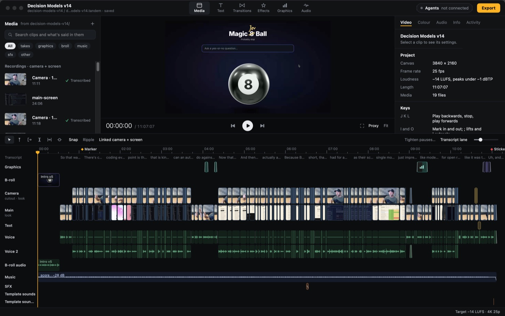

#  tandem

A video editor that me and my AI agents can both work on

macOS

<!-- media: hero -->
<!--  -->
<!-- media: hero -->

## What it is

This is the video editor I'm building for my Convex videos to replace Filmora. It's built so my agents can edit the same project as me, through a CLI and an MCP server, while I work in the app.

A project is just a `.tandem` JSON file in the video's folder. Tandem finds the media there, pairs up my Record It camera and screen takes, and does transcripts, waveforms and the cutout in the background.



## Get it

Paste this into your AI coding agent (Claude Code, Codex, Cursor...):

> Clone https://github.com/mikecann/tandem and make it my own. It's one of Mike
> Cann's personal tools, so read the README first, change anything specific to his
> setup to suit mine, then help me get it running.

### Or set it up by hand

You'll need macOS 15 or newer and Xcode 26 or newer with Swift 6. Some analysis
features, such as SpeechAnalyzer transcription, need macOS 26. SwiftPM fetches
the Lottie dependency during the first build. Install ffmpeg if you want to
import formats macOS can't decode, such as WebM (`brew install ffmpeg`).

```bash
git clone https://github.com/mikecann/tandem.git
cd tandem
bash setup_mac.sh
bash install.sh
tandem app
```

`setup_mac.sh` builds and signs the release app at `~/Applications/Tandem.app`.
`install.sh` links this clone's launcher into `~/.local/bin`; you can pass a
custom bin directory. Add that directory to your PATH if it isn't there yet.
Keep the clone in place, and rerun `install.sh` if you move it.

Tandem doesn't read `.env` files or need API keys to edit local media.
Optional asset providers use macOS Keychain. `tandem assets providers` tells
you what's missing, and [the asset guide](docs/ASSETS.md) covers setup.

## Using it

`tandem app [project.tandem]` opens the editor. Every other command goes to
the agent CLI (`tandem help`). For a new video folder:

```bash
cd /path/to/video
tandem new Video.tandem
tandem app Video.tandem
tandem status
tandem timeline --summary
```

For agents, add the MCP server once:

```bash
claude mcp add tandem -- ~/Applications/Tandem.app/Contents/MacOS/tandem mcp
```

Old Filmora projects import with `tandem import filmora "Video v3.wfp"`.
Agent EDLs import with `tandem import edl edit.json --recipe decision-models`.
That recipe has paths and settings for my Decision Models video, so change
it for your footage or add your own. The [agent guide](docs/AGENTS.md) has
command examples, import options and troubleshooting.

Stickers, graphics, sounds, music, looks, fonts and saved segments that
every video reuses live in `~/Movies/Tandem Library`, which Tandem makes
the first time it opens. Projects use those files where they are; `tandem
archive` (File > Archive project...) copies the ones a project uses into it
before it moves to another Mac.

## Working on Tandem

```bash
swift test
bash restart.sh
```

`restart.sh` builds a debug app and opens it. Set `TANDEM_APP_DIR` to build
somewhere other than `~/Applications/Tandem.app`.

Run `bash tests/install-tests.sh` to check the launcher installation without
touching your app. The default Swift tests use synthetic media and fixtures.
Real footage, live provider calls and paid generation use opt-in flags
documented in the guides. `TANDEM_SPEECH_TESTS=1` enables the speech-service
test, which may install a language model and needs macOS 26.

| Doc | What's in it |
| --- | --- |
| `docs/ARCHITECTURE.md` | The contract between the modules: model, ripple modes, transforms, folders |
| `docs/PLAN.md` | The V1 task list and what's done |
| `docs/AGENTS.md` | The CLI, MCP and HTTP API for agents, with an example of every edit command |
| `docs/MEDIA.md` | Scanning, take pairing and the background analysis jobs |
| `docs/RENDER.md` | The compositor, transitions, titles, audio mix and export |
| `docs/ASSETS.md` | The asset library: sources, licences, normalising and credits |

## Layout

| Folder | What's there |
| --- | --- |
| `Sources/TandemCore` | Model, time, commands, editing, undo, journal |
| `Sources/TandemMedia` | Folder scanning, probing, analysis jobs |
| `Sources/TandemRender` | Composition, compositor, audio mix, export |
| `Sources/TandemAPI` | Project session, service, local server, MCP |
| `Sources/TandemAssets` | Asset library: catalogue, sources, normalising, credits |
| `Sources/TandemImport` | Filmora and EDL importers |
| `Sources/TandemApp` | The app |
| `Sources/TandemCLI` | The `tandem` command |
| `tests/` | XCTest targets, one per library |

## More tools

You can find my other tools at [mikerosoft.app](https://mikerosoft.app).

MIT licensed. See [LICENSE](LICENSE). Bundled fonts and other third-party
assets retain their own licences, which ship alongside them.
